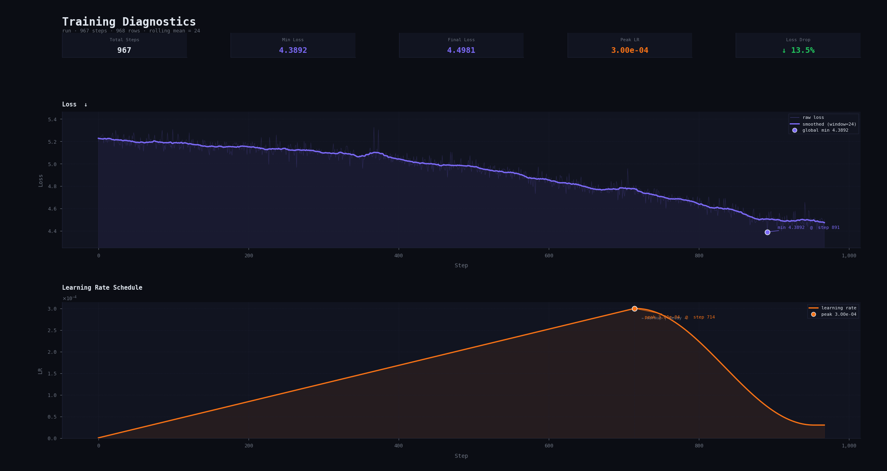
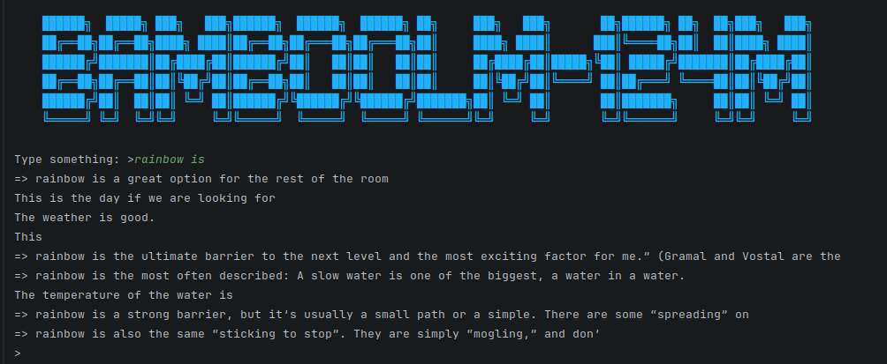

#
```markdown
    
    ██████╗  █████╗ ███╗   ███╗██████╗  ██████╗  ██████╗ ██╗     ███╗   ███╗       ██╗██████╗ ██╗  ██╗███╗   ███╗
    ██╔══██╗██╔══██╗████╗ ████║██╔══██╗██╔═══██╗██╔═══██╗██║     ████╗ ████║      ███║╚════██╗██║  ██║████╗ ████║
    ██████╔╝███████║██╔████╔██║██████╔╝██║   ██║██║   ██║██║     ██╔████╔██║█████╗╚██║ █████╔╝███████║██╔████╔██║
    ██╔══██╗██╔══██║██║╚██╔╝██║██╔══██╗██║   ██║██║   ██║██║     ██║╚██╔╝██║╚════╝ ██║██╔═══╝ ╚════██║██║╚██╔╝██║
    ██████╔╝██║  ██║██║ ╚═╝ ██║██████╔╝╚██████╔╝╚██████╔╝███████╗██║ ╚═╝ ██║       ██║███████╗     ██║██║ ╚═╝ ██║
    ╚═════╝ ╚═╝  ╚═╝╚═╝     ╚═╝╚═════╝  ╚═════╝  ╚═════╝ ╚══════╝╚═╝     ╚═╝       ╚═╝╚══════╝     ╚═╝╚═╝     ╚═╝
    
```                                                                                                


---
# Overview

BambooLM-124M is a lightweight GPT-style autoregressive language model
built using the GPT-2 Small architecture with approximately **124 million parameters**.

The project focuses on:
- Understanding transformer architectures from scratch
- Efficient large language model training
- Scalable decoder-only transformer implementations
- Educational and research experimentation
- Clean and modular PyTorch implementation

BambooLM-124M follows the standard causal language modeling approach
using masked self-attention and next-token prediction.

---

# Features

- GPT-2 style decoder-only transformer
- 124M trainable parameters
- 1024 token context length
- Byte Pair Encoding (BPE) tokenizer
- Multi-Head Self Attention
- Residual connections and LayerNorm
- Mixed precision training support
- Gradient accumulation
- Efficient autoregressive text generation
- Modular PyTorch codebase
- Hugging Face style architecture compatibility

---

# Model Architecture

BambooLM-124M follows the GPT-2 Small architecture configuration.

## Configuration

| Parameter | Value | Description |
|---|---|---|
| Vocabulary Size (`vocab_size`) | 50,257 | Standard GPT-2 Byte Pair Encoding vocabulary |
| Context Length (`block_size`) | 1,024 | Maximum sequence length |
| Transformer Layers (`n_layer`) | 12 | Number of transformer decoder blocks |
| Attention Heads (`n_head`) | 12 | Multi-head self attention heads |
| Embedding Dimension (`n_embd`) | 768 | Hidden embedding size |
| Parameters | ~124M | Total trainable parameters |
| Architecture | Decoder-only Transformer | GPT-2 style autoregressive model |

---

## Transformer Components

The architecture contains:

- Token Embeddings
- Positional Embeddings
- Multi-Head Causal Self-Attention
- Feed Forward Networks (MLP)
- Residual Connections
- Layer Normalization
- Final Language Modeling Head

---

## Attention Mechanism

BambooLM uses **causal multi-head self-attention**, where each token
can only attend to previous tokens in the sequence.

This masking mechanism prevents information leakage from future tokens
during training and enables autoregressive text generation.

The model predicts the next token based on all previous context:

:contentReference[oaicite:0]{index=0}

BambooLM follows the GPT-2 attention design with:
- Causal attention masking
- Multi-head attention
- Learned positional embeddings
- Residual attention blocks

---

# Training Configuration

## Batch Configuration

| Parameter | Value |
|---|---|
| Micro Batch Size (`B`) | 8 |
| Context Length (`T`) | 1,024 |
| Tokens per Micro Batch | 8,192 |
| Total Batch Size | 524,288 tokens |
| Gradient Accumulation | Configurable |

---

## Training Details

| Setting | Value |
|---|---|
| Framework | PyTorch |
| Precision | FP16 / BF16 |
| Optimizer | AdamW |
| Learning Rate Scheduler | Cosine Decay |
| Weight Decay | 0.1 |
| Training Objective | Next Token Prediction |
| Model Type | Autoregressive Language Model |
| Attention Type | Causal Self Attention |

---
# Training Curves

The following plots show the loss progression and learning rate schedule
during BambooLM-124M training on 500M tokens.

<p align="center">
  
</p>

- Top: Training loss across optimization steps
- Bottom: Cosine learning rate schedule

---
# Sample output after 500M token traning
<p align="center">
  
</p>


---
## Parameter Scale

| Model | Parameters |
|---|---|
| BambooLM-124M | 124M |
| GPT-2 Small | 124M |

BambooLM-124M is architecturally comparable to GPT-2 Small while maintaining
a clean and extensible implementation for experimentation and research.

---
## Acknowledgments

* A massive thank you to [Andrej Karpathy](https://github.com/karpathy) for his incredible educational content.
---
## License

This project is licensed under the MIT License - see the [LICENSE](LICENSE) file for details.
